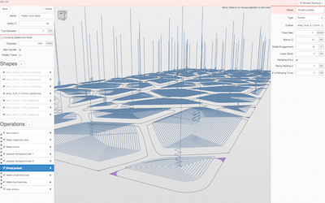
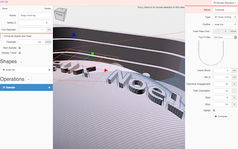
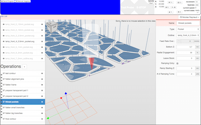

Webgcode
========
The beginning of a browser integrated CNC milling machine.

I have a Mac, and there are no real software to control a milling machine from that kind of computer. I decided to hack some random pieces of technology together.
Other people might be interested so I did everything in web technologies for easy trial.

I am trying to remove the dependency on g-code, because I don't like it, but I might retain some compatibility, so that users can tip toe into the system.

Web Stuff
---------

 

A preliminary CAM system for toolpath generation is present here: http://nraynaud.github.io/webgcode/webapp/visucamTest.html#/

There is a g-code simulator here: http://nraynaud.github.io/webgcode/ (that's where the name comes from).

Controller Board
----------------

The controller is a STM32F4-DISCOVERY board directly connected to the stepper drivers isolators (open drain configuration).
There is a USB cable between the board and the laptop, where a Chrome application controls the machine.
The controller is quite dumb, it gets a list of steps, direction and their timing from the computer and executes them. The interpolation is entirely done offline on the computer.

Pushing the user button (blue) enter the manual control mode, receiving a program on USB automatically exits the manual mode.
The orange LED is on when manual is on. The manual control is made through joysticks.

The controller is also connected to the VFD through an SPI isolated breakout board.

The wiring is described in the [main.c](interpolator/main.c#L10) and [manual.c](interpolator/manual.c#L11) files.

Chrome Application
------------------

On the computer, you can send the program to the machine. The application's main part is simply an iframe with the normal CAM html page in it (they talk with messages).

The USB protocol is custom since I couldn't find any standard, tell me if you know of any USB protocol to send sequences of steps to a machine (there is no g-code interpolator in the embedded system). 

This is all Chrome technology in the hope to remove OS re-compilation/deployment efforts.

License
-------

As you can see, there is no license currently, it's a readable source private software. 
I have currently no job and I keep my options open to make money off of this codebase one day, and also open source licenses are a pain to choose. 

Open Source
-----------

If you want to fork it for some open source stuff, contact me, I'll release a branch under a licence of your choosing for you to fork from, that way you can start an open source fork and I can keep the upcoming commits non free. 
I will do that out of vanity/trying to get some fame that could get me some food on the table one day.

Contact
-------

To contact me about anything, you can use the issues system, there is no traffic on it.
